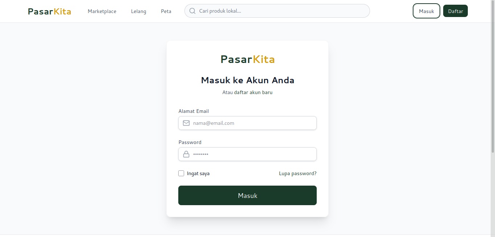
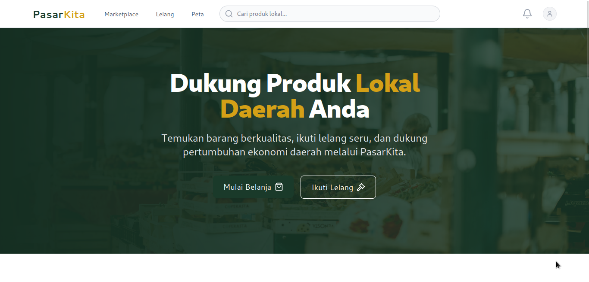
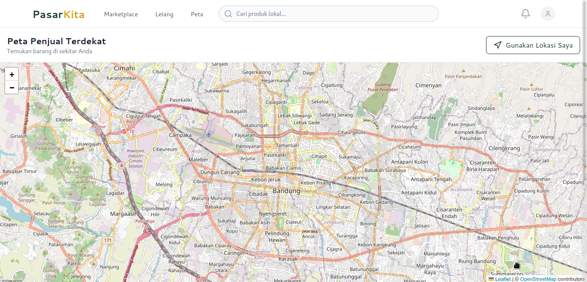
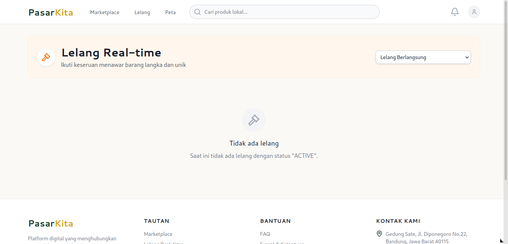
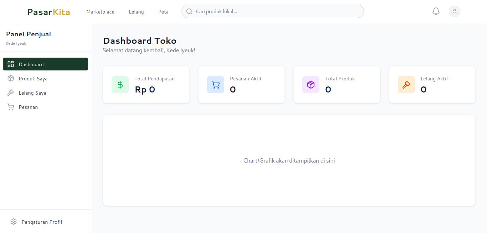
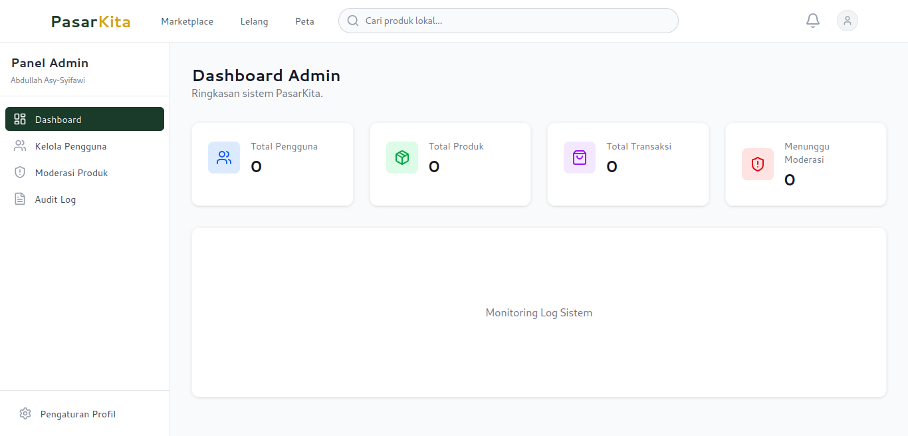

# Sistem Informasi Marketplace dan Lelang Barang Daerah

## Deskripsi Singkat Aplikasi
Sistem Informasi Marketplace dan Lelang Barang Daerah merupakan aplikasi berbasis web yang bertujuan untuk mempertemukan penjual dan pembeli dalam satu platform digital. Aplikasi ini memungkinkan penjual untuk menjual barang dengan mencantumkan informasi seperti harga, kondisi barang, foto, dan lokasi penjualan.

Selain fitur marketplace, aplikasi ini juga menyediakan sistem lelang real-time menggunakan WebSocket sehingga pengguna dapat memberikan penawaran harga secara langsung tanpa perlu melakukan refresh halaman. Pembeli juga dapat mencari barang berdasarkan kategori, melihat lokasi barang melalui peta digital, serta memberikan ulasan dan rating setelah transaksi selesai.

---

## Tujuan Pengembangan Aplikasi
Tujuan utama pengembangan aplikasi ini adalah menyediakan platform jual beli barang daerah yang lebih modern, mudah, cepat, dan efisien. Sistem ini membantu masyarakat menemukan barang lokal, melakukan transaksi dengan lebih terpercaya, serta mendukung pelaku UMKM dan penjual lokal dalam memasarkan produk mereka.

---

## Fitur yang Tersedia

### Fitur Penjual
- Registrasi dan login akun penjual.
- Menambahkan produk beserta kategori, harga, kondisi, foto, dan lokasi.
- Mengelola produk yang dijual.
- Membuka dan mengelola sistem lelang.
- Melihat penawaran harga tertinggi secara real-time.
- Melihat statistik penjualan melalui dashboard.

### Fitur Pembeli
- Registrasi dan login akun pembeli.
- Melihat daftar produk marketplace.
- Mencari produk berdasarkan nama.
- Filter produk berdasarkan kategori dan rentang harga.
- Melakukan pembelian produk.
- Melihat lokasi penjual melalui map digital.
- Mengikuti proses lelang secara real-time.
- Memberikan review dan rating produk.
- Menerima notifikasi terkait aktivitas lelang dan transaksi.

### Fitur Admin
- Mengelola data pengguna.
- Mengelola data produk.
- Menghapus produk yang melanggar aturan.
- Melihat riwayat aktivitas melalui audit log.

### Fitur Tambahan
- Lelang real-time menggunakan WebSocket.
- Live activity feed dan countdown timer lelang.
- Sistem notifikasi otomatis.
- Sistem review dan rating produk.
- Kategori produk dengan filter dan sorting lanjutan.
- Manajemen transaksi dengan status:
  - PENDING
  - PAID
  - SHIPPED
  - COMPLETED
  - CANCELLED
  - REFUNDED
- Dashboard statistik penjual.
- Anti-bid sniping (penambahan waktu lelang otomatis ketika terdapat bid di detik terakhir).
- Perhitungan ongkir dinamis berdasarkan radius GPS.
- Badge verifikasi untuk UMKM atau produsen lokal.

---

## Teknologi, Framework, Library, dan Tools

### Frontend
- HTML
- CSS
- JavaScript
- React.js

### Backend
- Node.js
- Express.js

### Database
- PostgreSQL
- Prisma ORM

### Library Tambahan
- Socket.io
- Socket.io Client
- React Context API

### Tools Development
- Visual Studio Code
- Figma
- npm

---

## Struktur Database

Database menggunakan PostgreSQL dengan Prisma ORM yang memiliki beberapa model utama:

- User
- Product
- Category
- Auction
- Transaction
- Review
- Notification
- AuditLog

---

## Panduan Instalasi dan Menjalankan Aplikasi

### Persyaratan
Pastikan perangkat telah terinstal:
- Node.js
- npm
- PostgreSQL

### Langkah Instalasi

1. Clone repository proyek:
```bash
git clone <URL_REPOSITORY>
```

2. Masuk ke direktori proyek:
```bash
cd nama-proyek
```

3. Install seluruh dependency:
```bash
npm install
```

4. Konfigurasi database PostgreSQL pada file `.env`.

5. Jalankan migrasi database menggunakan Prisma:
```bash
npx prisma migrate dev
```

6. Jalankan backend:
```bash
npm run dev
```

7. Jalankan frontend pada terminal yang berbeda:
```bash
npm run dev
```

8. Buka aplikasi melalui browser pada alamat localhost yang muncul pada terminal.

---

## Struktur Halaman Aplikasi

### Halaman Login
Menampilkan form email dan password untuk melakukan autentikasi pengguna.

### Halaman Beranda Marketplace
Menampilkan daftar produk lengkap dengan foto, harga, kondisi, kategori, lokasi, serta fitur pencarian dan filter.

### Halaman Detail Produk
Menampilkan informasi lengkap produk, deskripsi, kondisi barang, harga, lokasi, serta ulasan pembeli.

### Halaman Map
Menampilkan lokasi penjual berdasarkan barang yang dicari pengguna.

### Halaman Lelang Real-Time
Menampilkan proses lelang secara langsung dengan update bid, riwayat penawaran, dan countdown timer.

### Dashboard Penjual
Menampilkan statistik penjualan seperti total pendapatan, jumlah produk aktif, pesanan, dan lelang yang sedang berlangsung.

### Halaman Admin
Menampilkan fitur pengelolaan pengguna, produk, dan audit log sistem.

---

## Screenshot Tampilan Aplikasi

Tambahkan screenshot aplikasi pada bagian berikut:

### Login


### Beranda Marketplace


### Detail Produk


### Map Produk


### Halaman Lelang


### Dashboard Penjual


### Dashboard Admin


---

## Pengembang

- Fachraja Ramadhan Sukma
- Abdullah Asy-Syifawi
